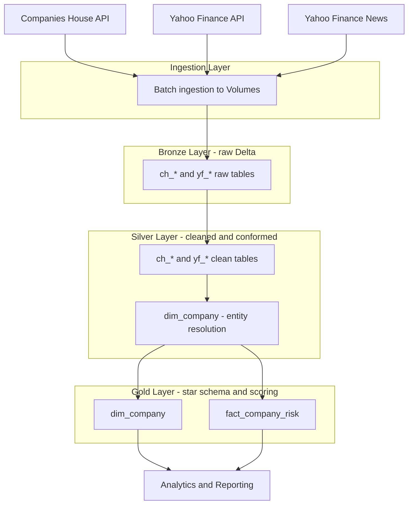
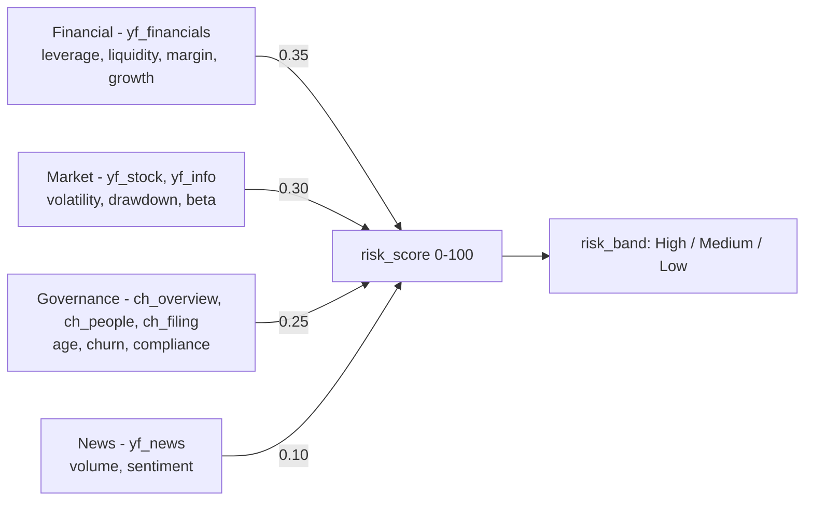

# System Architecture
## Company Risk Intelligence Platform

An end-to-end data engineering platform that integrates company registry data, financial market data, and financial news into a unified company risk model. Built on Databricks using a Medallion architecture (Bronze → Silver → Gold) with Delta Lake and Unity Catalog.

---

## 1. Overview

The platform ingests data from three external sources, cleans and conforms it, resolves company identity across systems, and produces a single per-company risk score. The Medallion pattern ensures traceability (raw data preserved in Bronze), data quality (cleaning in Silver), and analytics-readiness (scoring in Gold).

- **Platform:** Databricks
- **Storage:** Unity Catalog Volumes (raw files) + Delta tables
- **Catalog:** `company_risk_intelligence_platform`
- **Schemas:** `bronze`, `silver`, `gold`
- **Processing:** Batch (PySpark)

---

## 2. High-Level Data Flow



---

## 3. Data Layers

### 3.1 Bronze Layer (Raw)

Stores unprocessed API responses read from Unity Catalog Volumes into Delta. No business transformation; lineage columns (`source_file`, ingestion timestamp) are added. `recursiveFileLookup` flattens date-partitioned folders into one table per dataset.

**Tables:** `ch_overview`, `ch_people`, `ch_filing_history`, `yf_stock`, `yf_info`, `yf_income_statement`, `yf_balance_sheet`, `yf_cashflow`, `yf_news`

### 3.2 Silver Layer (Cleaned)

Flattens nested JSON (structs and arrays), types columns (dates, doubles), removes duplicates on business keys, handles nulls and NaN, and reshapes wide financial statements into long format. Loaded idempotently via SCD Type 1 MERGE.

**Tables:** `dim_company`, `ch_overview`, `ch_people`, `ch_filing_history`, `yf_info`, `yf_stock`, `yf_financials`, `yf_news`

### 3.3 Entity Resolution

`dim_company` is the bridge that unifies identifiers across sources. Companies House tables key on `company_number`; Yahoo Finance tables key on a ticker (`ticker` or `ticker_safe`). `dim_company` carries all identifiers and assigns a canonical `company_id`.

### 3.4 Gold Layer (Star Schema + Scoring)

Each Silver table is aggregated to **one row per company**, normalized to 0–100 across the universe, and combined into a weighted composite score.

**Tables:** `dim_company`, `fact_company_risk`

---

## 4. Star Schema

```mermaid
erDiagram
    DIM_COMPANY ||--|| FACT_COMPANY_RISK : describes

    DIM_COMPANY {
        string company_id PK
        string company_name
        string company_number
        string ticker
        string ticker_safe
        string sector
        string industry
    }

    FACT_COMPANY_RISK {
        string company_id PK_FK
        double financial_score
        double market_score
        double governance_score
        double news_score
        double risk_score
        string risk_band
        date score_date
    }
```

---

## 5. Risk Scoring Engine

Four independent pillars feed the composite score. Each pillar is computed from Silver, normalized 0–100 across the 20 companies, and weighted.



```
risk_score = 0.35·financial + 0.30·market + 0.25·governance + 0.10·news
```

Weights reflect data confidence: financial and market signals are strongest and best-populated; news is the lightest pillar.

---

## 6. Key Design Principles

- **Modularity** — each layer is an independent, maintainable notebook.
- **Traceability** — raw responses preserved in Bronze with file lineage.
- **Reusability** — shared helpers (`scd_merge`, `keep_latest`) across tables.
- **Separation of concerns** — ingestion, cleaning, resolution, and scoring are decoupled.
- **Idempotency** — SCD Type 1 MERGE makes re-runs safe.
- **Explainability** — four-pillar scoring lets any risk verdict be traced to its cause.

---

## 7. Core Components

| Component | Responsibility |
| --- | --- |
| Ingestion pipelines | Extract from APIs, land JSON in Volumes |
| Bronze builders | Read raw JSON into Delta with lineage |
| Silver transforms | Flatten, type, dedupe, conform |
| Entity resolution | Map company ↔ ticker via `dim_company` |
| Scoring engine | Aggregate, normalize, weight → `fact_company_risk` |

---

## 8. Technology Stack

| Layer | Technology |
| --- | --- |
| Ingestion | Python, `requests`, `yfinance` |
| Storage | Unity Catalog Volumes, Delta Lake |
| Processing | PySpark on Databricks |
| Modeling | Delta tables, star schema |
| Orchestration | Databricks Workflows / Notebooks |

---

## 9. Future Enhancements

- Real-time / streaming ingestion (e.g. Kafka / Auto Loader).
- Machine-learning-based risk prediction.
- NLP sentiment analysis replacing the lexicon approach.
- BI dashboard integration (Power BI / Tableau).
- Optional Tier-2 star extension: `fact_stock_performance` + `dim_date` for daily time-series analysis, and `dim_news_event` for news as a first-class dimension.
- Sector-relative scoring and global company expansion.

---

## Note on scope

This architecture documents the **implemented Tier-1 design**: a single star (`dim_company` + `fact_company_risk`) at company grain. A Tier-2 extension (daily stock fact, date dimension, news dimension) is described under Future Enhancements and can be added without changing the Tier-1 model.
